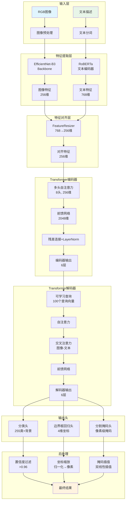
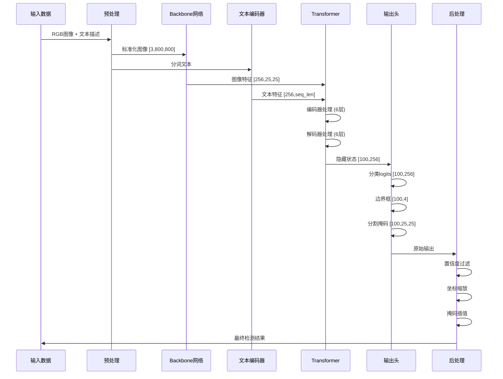
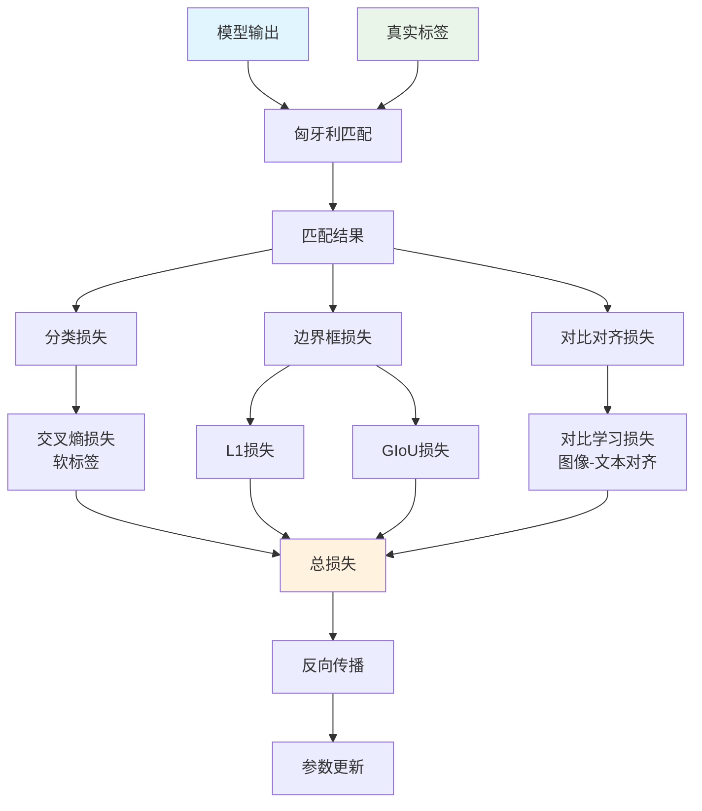
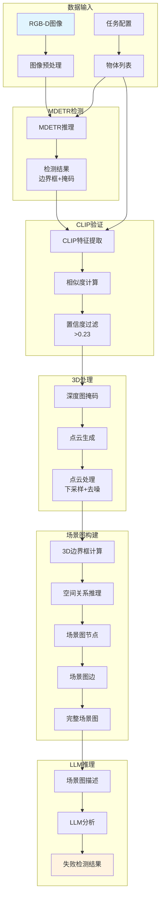
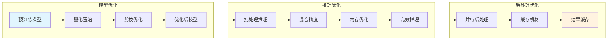
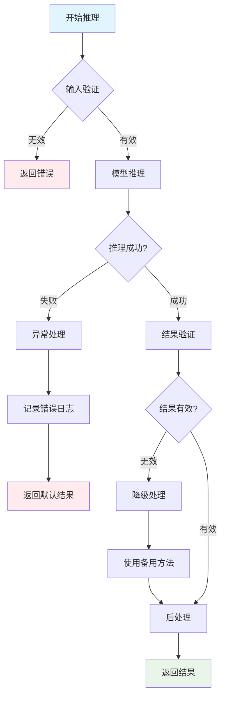

# MDETR 工作流程图解

## 1. 整体架构流程图



## 2. 详细推理流程图



## 3. 损失计算流程图



## 4. Real-World集成流程图



## 5. 性能优化流程图



## 6. 错误处理流程图



## 7. 关键代码执行路径

### 7.1 主要函数调用链

```
main() 
├── load_model()
│   ├── mdetr_efficientnetB3_phrasecut()
│   └── model.eval()
├── preprocess_image()
│   ├── T.Resize(800)
│   ├── T.ToTensor()
│   └── T.Normalize()
├── inference()
│   ├── model.forward()
│   │   ├── backbone.forward()
│   │   ├── transformer.forward()
│   │   └── output_heads.forward()
│   └── postprocess()
│       ├── confidence_filtering()
│       ├── bbox_scaling()
│       └── mask_interpolation()
└── return_results()
```

### 7.2 关键参数配置

```python
# 模型配置
MODEL_CONFIG = {
    "backbone": "timm_tf_efficientnet_b3_ns",
    "d_model": 256,
    "nhead": 8,
    "num_encoder_layers": 6,
    "num_decoder_layers": 6,
    "num_queries": 100,
    "num_classes": 255,
    "text_encoder": "roberta-base"
}

# 推理配置
INFERENCE_CONFIG = {
    "confidence_threshold": 0.96,
    "image_size": 800,
    "batch_size": 1,
    "device": "cuda:0"
}

# 后处理配置
POSTPROCESS_CONFIG = {
    "mask_threshold": 0.5,
    "kernel_size": 3,
    "erosion_iterations": 2,
    "interpolation_mode": "bilinear"
}
```

## 8. 数据流图

```mermaid
graph LR
    subgraph "输入数据"
        A1[RGB: [H,W,3]]
        A2[Depth: [H,W]]
        A3[Text: "object_name"]
    end
    
    subgraph "预处理"
        B1[Resize: [800,800]]
        B2[Normalize: ImageNet]
        B3[Tokenize: RoBERTa]
    end
    
    subgraph "特征提取"
        C1[Image Features: [256,25,25]]
        C2[Text Features: [256,seq_len]]
    end
    
    subgraph "Transformer"
        D1[Encoder: 6 layers]
        D2[Decoder: 6 layers]
        D3[Output: [100,256]]
    end
    
    subgraph "输出头"
        E1[Logits: [100,256]]
        E2[Boxes: [100,4]]
        E3[Masks: [100,25,25]]
    end
    
    subgraph "后处理"
        F1[Filter: conf > 0.96]
        F2[Scale: norm → pixel]
        F3[Interpolate: [H,W]]
    end
    
    A1 --> B1 --> C1 --> D1 --> D2 --> E1
    A2 --> F3
    A3 --> B3 --> C2 --> D1
    E1 --> F1
    E2 --> F2
    E3 --> F3
    
    style A1 fill:#e1f5fe
    style A2 fill:#e1f5fe
    style A3 fill:#e8f5e8
    style F1 fill:#fff3e0
    style F2 fill:#fff3e0
    style F3 fill:#fff3e0
```

这些流程图详细展示了MDETR在Real-World机器人系统中的完整工作流程，从输入处理到最终结果输出，包括模型架构、推理过程、损失计算、性能优化和错误处理等各个方面。通过这些图表，可以更好地理解MDETR的工作原理和实现细节。


