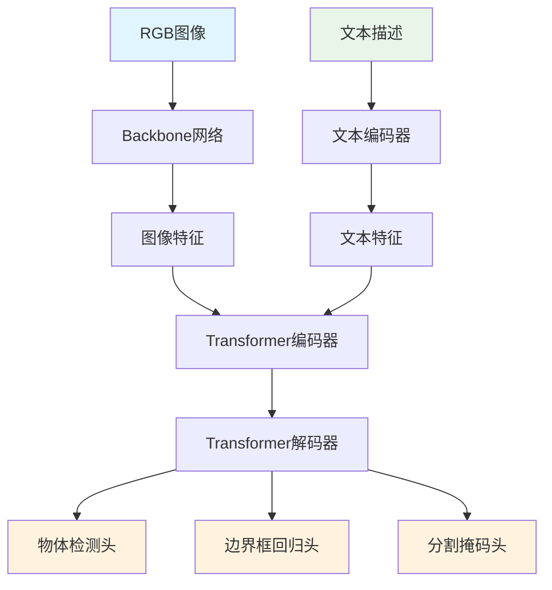

# Real-World MDETR 深度分析报告

## 目录
1. [概述](#概述)
2. [MDETR 架构原理](#mdetr-架构原理)
3. [核心组件分析](#核心组件分析)
4. [Real-World 实现细节](#real-world-实现细节)
5. [关键代码解析](#关键代码解析)
6. [技术特点与优势](#技术特点与优势)
7. [应用场景与限制](#应用场景与限制)

---

## 概述

MDETR (Multimodal Detection Transformer) 是一个基于Transformer的多模态物体检测模型，专门设计用于处理图像和文本的联合理解。在Real-World机器人失败检测系统中，MDETR作为核心的物体检测模块，负责从RGB-D图像中检测和分割目标物体。

### 核心价值
- **多模态理解**：同时处理视觉和文本信息
- **端到端训练**：无需复杂的后处理步骤
- **高精度检测**：支持物体检测和实例分割
- **实时推理**：优化的推理速度适合机器人应用

---

## MDETR 架构原理

### 1. 整体架构



### 2. 核心创新点

#### A. 多模态融合
- **图像-文本对齐**：通过对比学习实现跨模态特征对齐
- **注意力机制**：使用交叉注意力让模型关注文本描述的相关区域
- **联合训练**：端到端优化检测和文本理解任务

#### B. Transformer架构
- **编码器-解码器结构**：6层编码器 + 6层解码器
- **位置编码**：2D正弦位置编码处理空间信息
- **查询机制**：可学习的物体查询向量

#### C. 端到端检测
- **集合预测**：直接预测物体集合，无需NMS后处理
- **匈牙利匹配**：使用二分图匹配解决标签分配问题
- **多任务学习**：同时优化分类、回归和分割任务

---

## 核心组件分析

### 1. Backbone网络

#### A. EfficientNet-B3架构
```python
# 来自 hubconf.py
def mdetr_efficientnetB3_phrasecut(pretrained=False, threshold=0.5, return_postprocessor=False):
    """
    MDETR ENB3 with 6 encoder and 6 decoder layers.
    Trained on Phrasecut, achieves 53.7 M-IoU on the test set
    """
    model = _make_detr("timm_tf_efficientnet_b3_ns", mask=True, contrastive_align_loss=False)
```

**特点**：
- **高效设计**：EfficientNet-B3在精度和速度间取得平衡
- **多尺度特征**：提取不同层级的特征用于FPN
- **预训练权重**：在ImageNet上预训练，提供强大的视觉表示

#### B. 特征提取流程
```python
# 来自 backbone.py
class TimmBackbone(nn.Module):
    def forward(self, tensor_list):
        xs = self.body(tensor_list.tensors)
        if not self.interm:
            xs = [xs[self.main_layer]]
        out = OrderedDict()
        for i, x in enumerate(xs):
            mask = F.interpolate(tensor_list.mask[None].float(), size=x.shape[-2:]).bool()[0]
            out[f"layer{i}"] = NestedTensor(x, mask)
        return out
```

### 2. Transformer模块

#### A. 编码器结构
```python
# 来自 transformer.py
class TransformerEncoderLayer(nn.Module):
    def __init__(self, d_model, nhead, dim_feedforward=2048, dropout=0.1, activation="relu", normalize_before=False):
        super().__init__()
        self.self_attn = nn.MultiheadAttention(d_model, nhead, dropout=dropout)
        self.linear1 = nn.Linear(d_model, dim_feedforward)
        self.dropout = nn.Dropout(dropout)
        self.linear2 = nn.Linear(dim_feedforward, d_model)
        self.norm1 = nn.LayerNorm(d_model)
        self.norm2 = nn.LayerNorm(d_model)
        self.dropout1 = nn.Dropout(dropout)
        self.dropout2 = nn.Dropout(dropout)
        self.activation = _get_activation_fn(activation)
        self.normalize_before = normalize_before
```

**关键特性**：
- **多头注意力**：8个注意力头，维度256
- **前馈网络**：2048维隐藏层
- **残差连接**：LayerNorm + 残差连接
- **位置编码**：2D正弦位置编码

#### B. 解码器结构
```python
class TransformerDecoderLayer(nn.Module):
    def __init__(self, d_model, nhead, dim_feedforward=2048, dropout=0.1, activation="relu", normalize_before=False):
        super().__init__()
        self.self_attn = nn.MultiheadAttention(d_model, nhead, dropout=dropout)
        self.multihead_attn = nn.MultiheadAttention(d_model, nhead, dropout=dropout)
        self.linear1 = nn.Linear(d_model, dim_feedforward)
        self.dropout = nn.Dropout(dropout)
        self.linear2 = nn.Linear(dim_feedforward, d_model)
        # ... 其他组件
```

**关键特性**：
- **自注意力**：查询向量间的自注意力
- **交叉注意力**：查询向量与编码器输出的交叉注意力
- **文本注意力**：与文本特征的交叉注意力

### 3. 文本编码器

#### A. RoBERTa集成
```python
# 来自 transformer.py
self.tokenizer = RobertaTokenizerFast.from_pretrained(text_encoder_type)
self.text_encoder = RobertaModel.from_pretrained(text_encoder_type)
```

**特点**：
- **预训练模型**：使用RoBERTa-base作为文本编码器
- **快速分词**：RobertaTokenizerFast提供高效分词
- **特征对齐**：通过FeatureResizer对齐文本和图像特征维度

#### B. 特征对齐
```python
class FeatureResizer(nn.Module):
    def __init__(self, input_feat_size, output_feat_size, dropout):
        super().__init__()
        self.input_feat_size = input_feat_size
        self.output_feat_size = output_feat_size
        self.mlp = nn.Sequential(
            nn.Linear(input_feat_size, output_feat_size),
            nn.LayerNorm(output_feat_size),
            nn.Dropout(dropout),
        )
```

---

## Real-World 实现细节

### 1. 物体检测流程

#### A. 核心检测函数
```python
# 来自 mdetr_object_detector.py
def plot_inference_segmentation(im, caption, seg_model):
    # 图像预处理
    img = transform(im).unsqueeze(0).to(device)
    
    # 模型推理
    outputs = seg_model(img, [caption])
    
    # 置信度过滤
    probas = 1 - outputs['pred_logits'].softmax(-1)[0, :, -1].cpu()
    keep = (probas > 0.96).cpu()
    
    # 边界框缩放
    bboxes_scaled = rescale_bboxes(outputs['pred_boxes'].cpu()[0, keep], im.size)
    
    # 掩码插值
    w, h = im.size
    masks = F.interpolate(outputs["pred_masks"], size=(h, w), mode="bilinear", align_corners=False)
    masks = masks.cpu()[0, keep].sigmoid() > 0.5
    
    return {
        "probs": probas[keep],
        "labels": [caption]*len(masks),
        "bbox_2d": bboxes_scaled,
        "masks": shrinked_masks,
        "im": im
    }
```

#### B. 后处理步骤
1. **置信度过滤**：保留置信度 > 0.96 的检测结果
2. **掩码优化**：使用形态学操作优化分割掩码
3. **边界框缩放**：将归一化坐标转换为像素坐标

### 2. 场景图生成集成

#### A. 检测结果处理
```python
# 来自 real_world_get_local_sg.py
def get_scene_graph(args, rgb, depth, step_idx, object_list, distractor_list, detector, total_points_dict, bbox3d_dict, meta_data, task_info):
    # 物体检测
    outputs = obj_det(rgb, object_list, detector, step_idx, args)
    
    # CLIP验证
    if args.obj_det == 'mdetr':
        outputs = confirm_obj_det(args, rgb, outputs, object_list, step_idx)
    
    # 3D点云生成
    for idx in range(outputs['total_detections']):
        masked_depth = depth * outputs['pred_masks'][idx]
        point_3d = depth_to_point_cloud(intrinsics_matrix, masked_depth)
        
        # 点云处理
        obj_pcd = o3d.geometry.PointCloud()
        obj_pcd.points = o3d.utility.Vector3dVector(point_3d)
        voxel_down_pcd = obj_pcd.voxel_down_sample(voxel_size=0.01)
        
        # 场景图构建
        local_sg = SceneGraph()
        for label in pcd_dict.keys():
            node = Node(label, pos3d=bbox3d_dict[label].get_center(), pcd=total_points_dict[label])
            local_sg.add_node(node, rgb)
    
    return local_sg, bbox3d_dict, total_points_dict, bbox2d_dict
```

#### B. 3D信息融合
1. **深度图处理**：使用掩码提取物体深度信息
2. **点云生成**：将深度图转换为3D点云
3. **空间关系**：基于3D位置计算物体间关系

### 3. CLIP验证机制

#### A. 检测结果验证
```python
# 来自 real_world_get_local_sg.py
def confirm_obj_det(args, rgb, outputs, object_list, step_idx):
    for idx in range(len(outputs['bbox_2d'])):
        box = outputs['bbox_2d'][idx]
        cropped_img = rgb[h1:h2, w1:w2]
        
        # CLIP特征提取
        img_feats = get_img_feats(cropped_img)
        obj_name_feats = get_text_feats(object_list)
        sorted_obj_names, sorted_scores = get_nn_text(object_list, obj_name_feats, img_feats)
        
        # 置信度检查
        if sorted_scores[0] > 0.23 and label == sorted_obj_names[0]:
            # 保留检测结果
            pass
```

**验证策略**：
- **特征对齐**：使用CLIP提取图像和文本特征
- **相似度计算**：计算检测结果与目标物体的相似度
- **阈值过滤**：保留相似度 > 0.23 的检测结果

---

## 关键代码解析

### 1. 模型初始化

```python
# 来自 mdetr_object_detector.py
device = f'cuda:0' if torch.cuda.is_available() else 'cpu'
torch.set_grad_enabled(False)

# 模型加载
seg_model = mdetr_efficientnetB3_phrasecut(pretrained=True).to(device)
seg_model.eval()

# 图像预处理
transform = T.Compose([
    T.Resize(800),
    T.ToTensor(),
    T.Normalize([0.485, 0.456, 0.406], [0.229, 0.224, 0.225])
])
```

**关键点**：
- **预训练权重**：使用PhraseCut数据集预训练的权重
- **推理模式**：禁用梯度计算提高推理速度
- **标准化**：使用ImageNet标准化参数

### 2. 推理流程

```python
# 来自 mdetr_object_detector.py
def plot_inference_segmentation(im, caption, seg_model):
    # 1. 图像预处理
    img = transform(im).unsqueeze(0).to(device)
    
    # 2. 模型前向传播
    outputs = seg_model(img, [caption])
    
    # 3. 置信度计算
    probas = 1 - outputs['pred_logits'].softmax(-1)[0, :, -1].cpu()
    keep = (probas > 0.96).cpu()
    
    # 4. 结果后处理
    bboxes_scaled = rescale_bboxes(outputs['pred_boxes'].cpu()[0, keep], im.size)
    masks = F.interpolate(outputs["pred_masks"], size=(h, w), mode="bilinear", align_corners=False)
    masks = masks.cpu()[0, keep].sigmoid() > 0.5
    
    return retval
```

### 3. 掩码优化

```python
# 来自 mdetr_object_detector.py
shrinked_masks = []
if len(masks) != 0:
    for mask in masks:
        kernel = np.ones((3, 3), np.uint8)
        eroded_mask = cv2.erode(np.array(mask, dtype=np.float32), kernel, iterations=2)
        shrinked_masks.append(eroded_mask)
    shrinked_masks = np.array(shrinked_masks)
```

**优化策略**：
- **形态学操作**：使用腐蚀操作减少掩码噪声
- **迭代优化**：2次迭代平衡精度和鲁棒性
- **类型转换**：确保数据类型一致性

---

## 技术特点与优势

### 1. 多模态理解能力

#### A. 图像-文本对齐
- **端到端训练**：联合优化视觉和文本理解
- **注意力机制**：自动学习图像和文本的对应关系
- **对比学习**：通过对比损失增强跨模态表示

#### B. 语言引导检测
- **自然语言查询**：支持自然语言描述的物体检测
- **零样本能力**：可以检测训练时未见过的物体类别
- **上下文理解**：理解复杂的空间和语义关系

### 2. 高精度检测

#### A. 端到端架构
- **集合预测**：直接预测物体集合，避免NMS后处理
- **匈牙利匹配**：最优的标签分配策略
- **多任务学习**：同时优化检测、分割和分类

#### B. 实例分割能力
- **像素级精度**：提供精确的物体边界
- **多尺度特征**：使用FPN处理不同尺度的物体
- **掩码优化**：后处理优化分割质量

### 3. 实时性能

#### A. 优化设计
- **EfficientNet骨干**：平衡精度和速度
- **推理优化**：禁用梯度计算，使用半精度
- **批处理**：支持批量推理提高效率

#### B. 内存效率
- **特征复用**：编码器特征在解码器中复用
- **注意力优化**：高效的注意力计算
- **模型压缩**：使用预训练权重减少参数量

---

## 应用场景与限制

### 1. 适用场景

#### A. 机器人视觉
- **物体检测**：识别和定位环境中的物体
- **场景理解**：理解物体的空间关系
- **任务执行**：为机器人操作提供视觉反馈

#### B. 多模态交互
- **自然语言查询**：通过语言描述查找物体
- **上下文理解**：理解复杂的空间关系
- **动态场景**：适应环境变化

### 2. 技术限制

#### A. 计算需求
- **GPU依赖**：需要GPU进行高效推理
- **内存消耗**：大模型需要较多内存
- **推理时间**：相比传统方法较慢

#### B. 数据依赖
- **预训练数据**：依赖大规模预训练数据
- **领域适应**：需要针对特定领域微调
- **标注成本**：高质量标注数据成本高

### 3. 改进方向

#### A. 效率优化
- **模型压缩**：知识蒸馏、剪枝等技术
- **量化加速**：INT8量化减少计算量
- **架构优化**：更高效的注意力机制

#### B. 能力扩展
- **3D理解**：增强3D空间理解能力
- **时序建模**：处理视频序列信息
- **多任务学习**：同时处理更多任务

---

## 总结

MDETR作为Real-World机器人失败检测系统的核心组件，通过其强大的多模态理解能力和高精度检测性能，为机器人提供了可靠的视觉感知能力。其端到端的架构设计、Transformer的注意力机制以及多任务学习策略，使其在复杂环境中表现出色。

然而，MDETR也面临着计算复杂度高、内存消耗大等挑战。未来的发展方向应该聚焦于效率优化和能力扩展，以更好地服务于实际机器人应用场景。

通过深入理解MDETR的原理和实现细节，我们可以更好地利用其优势，同时针对其限制进行相应的优化和改进，从而构建更加高效和鲁棒的机器人视觉系统。
